> 작성: 회계팀 | 기준일: 2022.10.31 | E-CMS 오픈: 2022.11.01

---

## 1. 개요

**E-CMS란?**  
인하우스뱅킹을 기반으로 한 자금관리 솔루션

**도입효과**
- 전결규정 별 자금업무 전자결재 및 내부통제 강화
- 안전 금융거래 보장 및 접근보안 강화
- 실시간 자금현황 모니터링 및 점검

**변경사항**
- SAP 경비처리 방법 일부 변경
- 경비관리시스템(BIZPLAY) 처리 범위 축소
- 경비지급규정 변경

---

## 2. 유형별 전표처리 방법

| 구분 (증빙 / 지급유형) | SAP | 비즈플레이 |
|---|:---:|:---:|
| 법인카드 | | O |
| 개인카드 | | O |
| 세금계산서 - 계좌이체 | | O |
| 세금계산서 - 가상계좌 | O | |
| 세금계산서 - 자동이체 | O | |
| 자산 (유무형, 재고) | O | |
| 기타영수증 (지로용지/원천징수영수증/간이영수증 등) | O | |
| 선급금 | O | |

> ##### 주의
>
> 가상계좌로 입금처리 되어야 하는 경우 경비처리는 **비즈플레이로 불가! SAP로 처리!**
{: .block-warning }

---

## 3. SAP 전표처리 매뉴얼

### 변경사항 요약

| 구분 | AS-IS | TO-BE |
|---|---|---|
| 거래처 계좌설정 | 거래처 등록 신청시 확인 | 거래처 등록 신청 시 + 전표처리 시 확인 |
| 가상계좌 | 전표 뒤 증빙으로 회계팀 개별 공지 또는 비즈플레이 지급구분에 기재 | 경비관리시스템(BIZPLAY) 처리 불가 / 전표 작성시 공급업체 추가데이터에 계좌정보 기입 |
| 거래처별 지급조건 | 관리 안함 | 거래처별 지급조건 확인(0001 ~ 0008) |

---

### 3-1. 일반비용전표 — Case 1. 일반 세금계산서 (세금코드 V3)

#### 1) 전표헤더 입력

경로: **회계 → 재무회계 → 채무 → 전표분개 → 전표임시저장 → 송장임시저장-일반 (F-63)**

| 항목 | 입력값 |
|---|---|
| ① 증빙일 | 전기일 입력 (세금계산서 날짜와 동일) |
| ② 회사코드 | 1000 / 통화선택 |
| ③ 참조 | 부서명 / 전표처리자 성명 |
| ④ 전표헤더텍스트 | 전표제목 입력 |

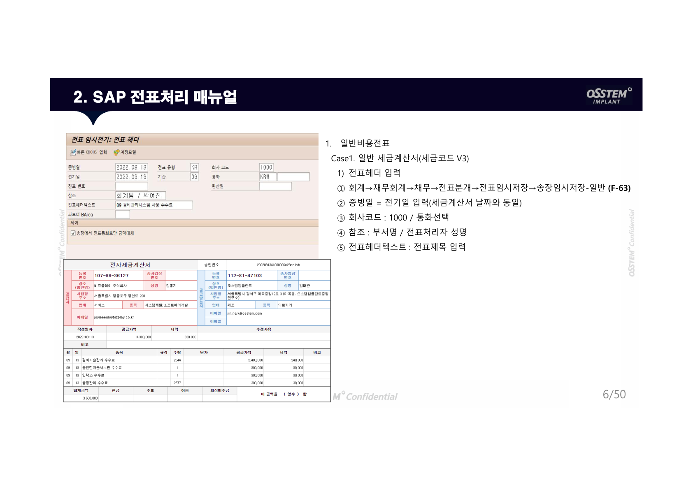
<!-- 📌 위 이미지를 교체하려면: assets/images/sap-manual/01_header_v3.png 파일을 저장하세요 -->

#### 2) 매입채무 계정 입력

| 항목 | 입력값 |
|---|---|
| ① 전기키 / 계정 | 31 / 거래처코드 입력 후 Enter |
| ② G/L 계정 | 확인 |
| ③ 금액 | 부가세 포함 금액 |
| ④ 사업영역 | 1000 서울본사 / 1090 부산생산본부 / 1100 체어사업본부 / 1200 영상장비사업본부 / 1300 재료생산사업부 / 1400 체어부품사업부 |
| ⑤ 지급조건 | 0001~0008 공급업체코드별 setting내역 확인 필요 |
| ⑥ 텍스트 | 세부내역 입력 |
| ⑦ | 추가데이터 클릭 |

**지급조건 코드표**

| 코드 | 내용 |
|---|---|
| 0001 | 일반 - 계좌이체 |
| 0002 | 일반 - 자동이체 |
| 0003 | 일반 - 지로이체 |
| 0004 | 일반 - 가상계좌 |
| 0005 | 보류 - 계좌이체 |
| 0006 | 보류 - 자동이체 |
| 0007 | 보류 - 지로이체 |
| 0008 | 보류 - 가상계좌 |

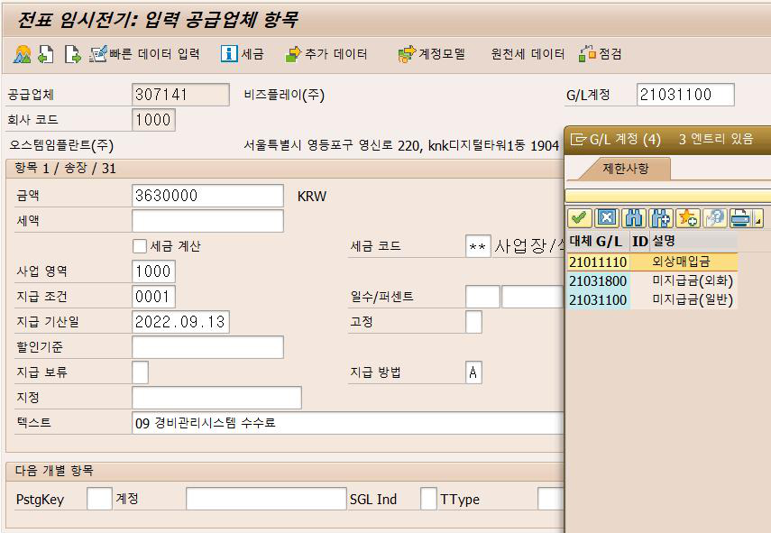
<!-- 📌 위 이미지를 교체하려면: assets/images/sap-manual/02_ap_v3.png 파일을 저장하세요 -->

#### 2-1) 매입채무 계정 입력 — 계좌 확인

| 항목 | 내용 |
|---|---|
| ⑧ 파트너 은행 클릭 | 계좌 선택 (등록계좌와 실제 입금요청 계좌 동일 여부 확인 必) |
| ⑨ 가상계좌의 경우 | 은행명 입력이 아닌 **은행코드** 입력 必 (별첨3 참고) |
| | 계좌번호는 `-` 제외하고 숫자만 입력 |
| | 가상계좌의 예금주는 당사명(오스템임플란트) 입력 |

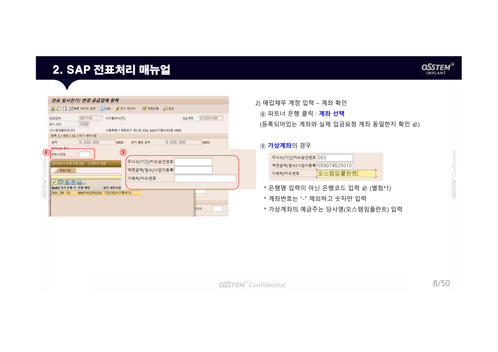
<!-- 📌 위 이미지를 교체하려면: assets/images/sap-manual/03_account_v3.png 파일을 저장하세요 -->

#### 3) 부가가치세 항목 입력

| 항목 | 입력값 |
|---|---|
| ① 전기키 40 / 계정 | 11161100 (선급부가가치세) 입력 후 Enter |
| ② 금액 | 세금계산서의 세액 |
| 기본금액 | 세금계산서의 공급가액 |
| ③ 세금코드 | V3 |
| ④ 사업장 | 공급받는 자의 사업자등록별 (별첨6 참고) / 사업영역 |
| ⑤ 지정 | 공급자의 사업자등록번호 (`-` 제외 10자리 숫자만) |
| ⑥ 텍스트 | 세부내역 입력 |

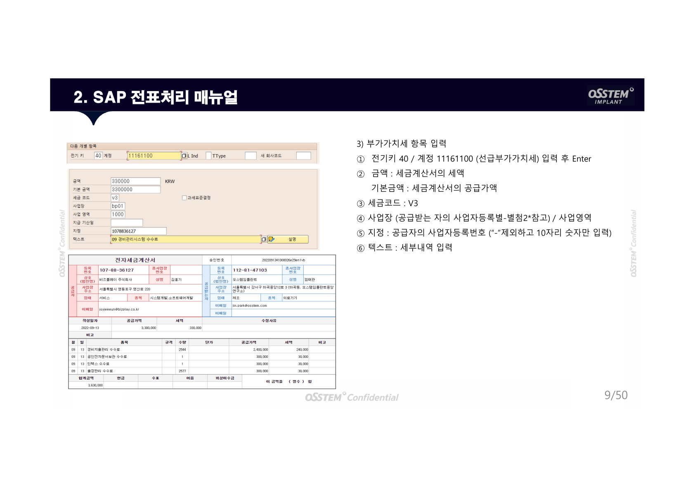
<!-- 📌 위 이미지를 교체하려면: assets/images/sap-manual/04_vat_v3.png 파일을 저장하세요 -->

#### 4) 비용계정 입력

| 항목 | 입력값 |
|---|---|
| ① 전기키 40 / 계정선택 후 Enter | |
| ② 금액 | 총 지급금액에서 부가가치세 제외한 금액 |
| ③ 세금코드 | V3 |
| ④ 코스트센터 | |
| ⑤ 텍스트 | 세부내역 입력 |
| ⑥ | 왼쪽 상단 개요(산모양) 클릭 → 전표내용 확인 후 **메뉴전표의 완료** 클릭하여 저장 |

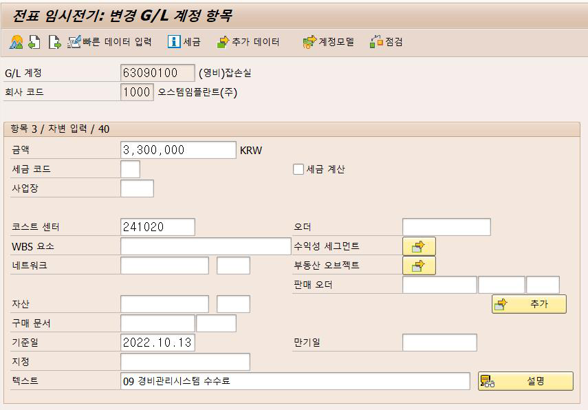
<!-- 📌 위 이미지를 교체하려면: assets/images/sap-manual/05_cost_v3.png 파일을 저장하세요 -->

---

### 3-2. 일반비용전표 — Case 2. 일반 계산서 (세금코드 V1)

#### 1) 전표헤더 입력

Case 1과 동일한 방법으로 입력 (F-63)

#### 2) 매입채무 계정 입력

Case 1과 동일하나 **세금코드 V1** 사용

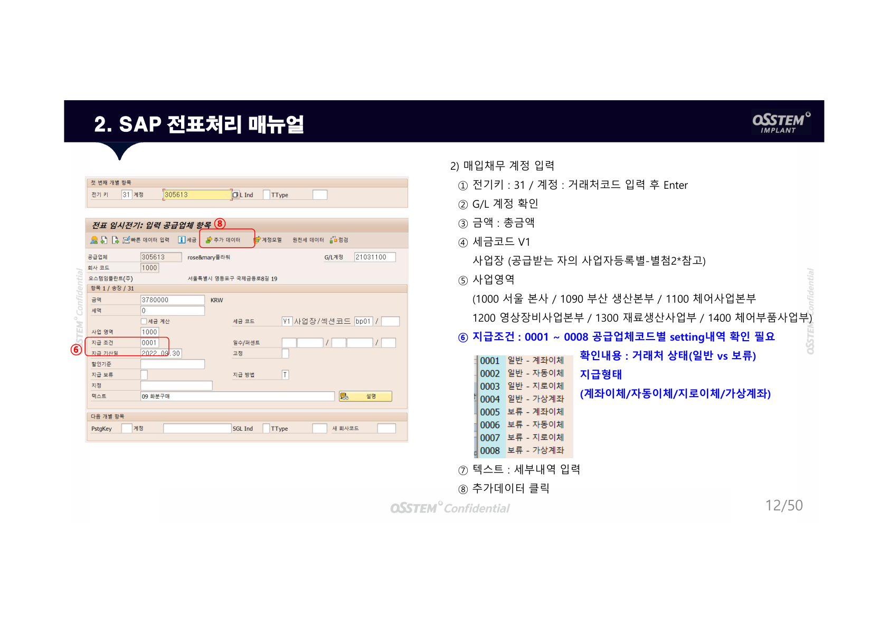
<!-- 📌 위 이미지를 교체하려면: assets/images/sap-manual/06_ap_v1.png 파일을 저장하세요 -->

#### 3) 비용계정 입력

| 항목 | 입력값 |
|---|---|
| ② 금액 | 공급가액 |
| ③ 세금코드 | V1 |

---

### 3-3. 일반비용전표 — Case 3. 매입불공제 세금계산서 (세금코드 X1/X3)

- X1 : 차량-세금
- X3 : 접대-세금

Case 1과 동일 절차, 세금코드만 **X1 또는 X3** 사용

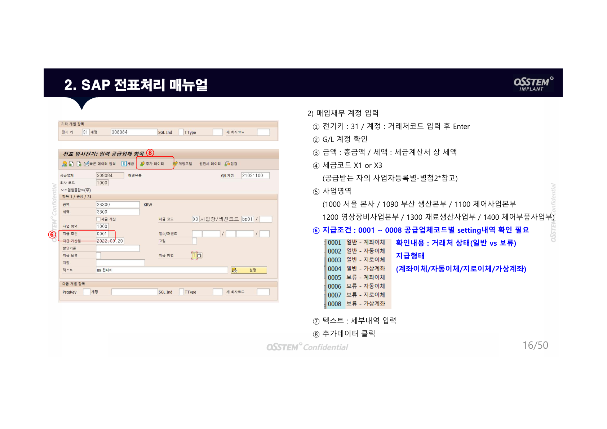
<!-- 📌 위 이미지를 교체하려면: assets/images/sap-manual/07_ap_x1x3.png 파일을 저장하세요 -->

---

### 3-4. 일반비용전표 — Case 4. 개인카드

#### 2) 매입채무 계정 입력

| 항목 | 입력값 |
|---|---|
| ① 전기키 / 계정 | 31 / 사원거래처 **7 + 사번** 입력 후 Enter |
| ② 금액 | 지급 받을 금액 |

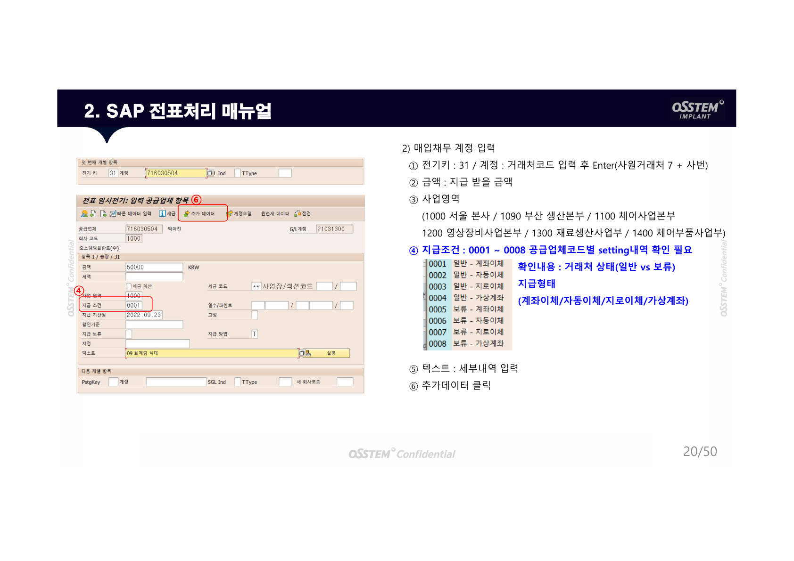
<!-- 📌 위 이미지를 교체하려면: assets/images/sap-manual/08_ap_personal.png 파일을 저장하세요 -->

#### 3) 부가가치세 항목 입력

| 항목 | 입력값 |
|---|---|
| ③ 세금코드 | V7 |
| ⑥ 텍스트 | **카드번호 입력** (SAP에 카드 미 등록시 전표처리 불가) |

---

### 3-5. 일반비용전표 — Case 5. 법인카드

#### 2) 매입채무 계정 입력

| 항목 | 입력값 |
|---|---|
| ① 전기키 / 계정 | 31 / **SS + 카드번호 뒤 8자리** 입력 후 Enter |
| ② 금액 | 총 사용 금액 |

#### 3) 부가가치세 항목 입력

| 항목 | 입력값 |
|---|---|
| ③ 세금코드 | V5 |

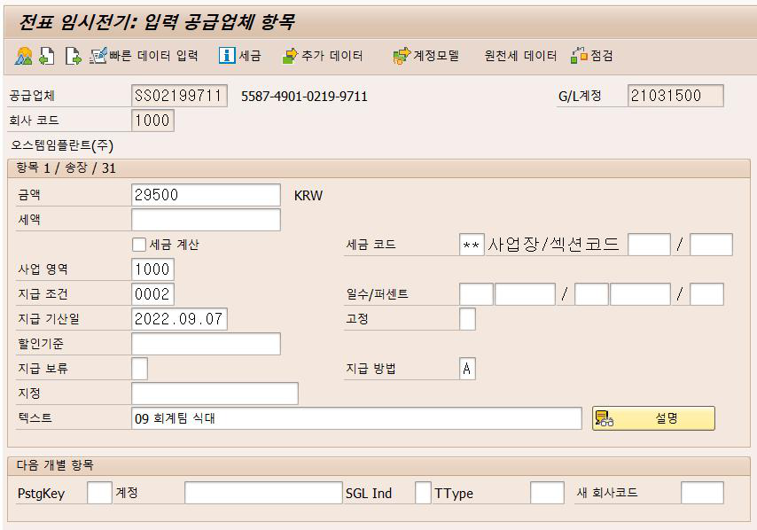
<!-- 📌 위 이미지를 교체하려면: assets/images/sap-manual/09_corp_card.png 파일을 저장하세요 -->

---

### 3-6. 유·무형자산전표

#### 4) 자산코드 입력

| 항목 | 입력값 |
|---|---|
| ① 전기키 70 / 계정 | 자산코드입력 / Ttype **100** Enter |
| ② 금액 | 총 지급금액에서 부가가치세 제외한 금액 |
| ③ 세금코드 | VA |

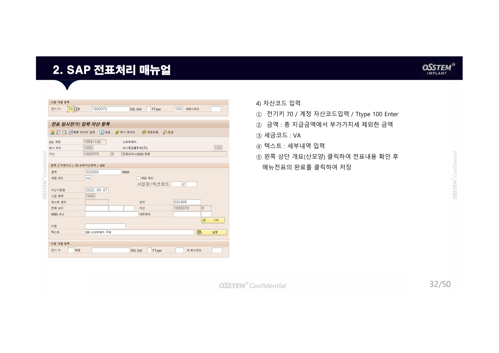
<!-- 📌 위 이미지를 교체하려면: assets/images/sap-manual/10_asset.png 파일을 저장하세요 -->

---

## 4. 경비관리시스템(비즈플레이) 처리 방법

**로그인**  
OPEN OSSTEM 연계시스템 → **경비관리시스템** 클릭  
- ID: 회사 메일주소  
- PW: qwer1234! (초기비밀번호) — 반드시 변경 후 사용

---

### Case 1. 세금계산서/계산서 처리

1. 비즈플레이 앱 메뉴에서 **인덱스 → 세금계산서** 클릭
2. 왼쪽 상단 **매입세금계산서** 클릭
3. 날짜 범위 지정 → 미처리 내역 음영 표시
4. 처리할 내역 체크박스 선택 → **결의서 작성** 클릭

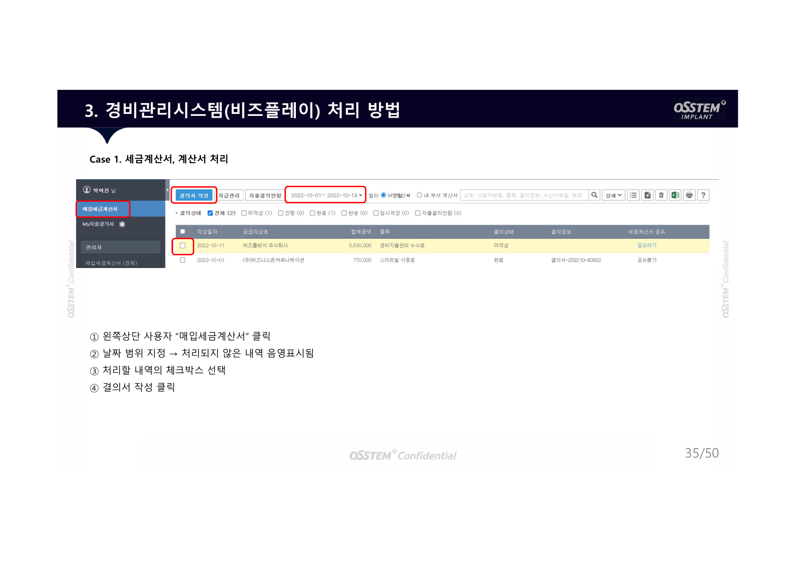
<!-- 📌 위 이미지를 교체하려면: assets/images/sap-manual/11_bizplay_tax.png 파일을 저장하세요 -->

**결의서 작성 항목**

| 항목 | 내용 |
|---|---|
| ① 결의서 내용 | 제목 및 내용 작성 |
| ② 계정 선택 | |
| ③ 적요사항 | 세부 내용 기재 |
| ④ 코스트센터 | 선택 |
| ⑤ 거래처 지급계좌 | SAP 등록 계좌 자동 생성 (가상계좌 처리 불가) |
| ⑥ 세금코드 | 해당 코드 선택 (V0/V1/V3/V4/V5/V8/V9/X1/X3) |
| ⑦ 사업장-사업영역 | 선택 |
| ⑧ 첨부서류 | 기안지/명세서 등 |
| ⑨ | **결재요청** → 결재선 선택 → 결의 완료 |

---

### Case 2. 법인카드 / 개인카드 처리

1. 비즈플레이 앱 → **카드영수증** 클릭
2. **법인카드 영수증** 메뉴에서 영수증 확인
3. 처리할 영수증 선택 → **영수증 일괄작성** 클릭
4. 아래 항목 입력 후 저장

| 항목 | 내용 |
|---|---|
| ④ G/L계정 | 선택 |
| ⑤ 적요 | 사용 내용 요약 |
| ⑥ 코스트센터 | 선택 |
| ⑦ 사업장 및 사업영역 | 선택 |
| ⑧ 신청금액 | 영수증 별 금액 |
| ⑨ 세금코드 | **V5** 입력 후 저장 |

5. 결의할 영수증 체크 → **결의서 작성** 클릭
6. **결재요청** → 결재선 선택 → 완료

---

## 5. 주의사항

1. **공급업체 계좌관리**
   - 전표처리 시 거래처 계좌확인 필수
   - 전표 확정 후 해당전표에 대한 입금계좌 변경 불가

2. **경비관리시스템(BIZPLAY) 처리 불가한 전표**
   - 세금계산서 수취한 경우라도 자동이체 혹은 가상계좌로 출금되어야 하는 경우는 비즈플레이 처리 불가
   - 가상계좌의 경우 전표처리 시 계좌정보 입력 필수

3. **전표처리 시 거래처별 지급유형 확인 필수**

---

## 별첨

### 별첨3. 은행코드

| 코드 | 은행 | 코드 | 은행 | 코드 | 은행 |
|---|---|---|---|---|---|
| 001 | 한국은행 | 034 | 광주은행 | 081 | 하나은행 |
| 002 | 산업은행 | 035 | 제주은행 | 088 | 신한은행 |
| 003 | 기업은행 | 037 | 전북은행 | 089 | 케이뱅크 |
| 004 | 국민은행 | 039 | 경남은행 | 090 | 카카오뱅크 |
| 007 | 수협 | 045 | 새마을금고 | 099 | 금융결제원 |
| 011 | 농협 | 048 | 신협 | 209 | 유안타증권 |
| 012 | 지역농협 | 050 | 저축은행 | 218 | KB증권 |
| 020 | 우리은행 | 054 | HSBC은행 | 238 | 미래에셋증권 |
| 023 | 제일은행 | 055 | 도이치은행 | 240 | 삼성증권 |
| 027 | 한국씨티은행 | 071 | 우체국 | 243 | 한국투자증권 |
| 031 | 대구은행 | 076 | 신용보증기금 | 267 | 대신증권 |
| 032 | 부산은행 | 077 | 기술보증기금 | 278 | 신한금융투자 |

### 별첨4. 지급구분

| 지급구분 | 명칭 |
|---|---|
| 0001 | 일반 - 계좌이체 |
| 0002 | 일반 - 자동이체 |
| 0003 | 일반 - 지로이체 |
| 0004 | 일반 - 가상계좌 |
| 0005 | 보류 - 계좌이체 |
| 0006 | 보류 - 자동이체 |
| 0007 | 보류 - 지로이체 |
| 0008 | 보류 - 가상계좌 |

> ##### 주의
>
> 지급구분 **보류** 설정시 자금집행 **불가**. 전표처리 후 확인 필요.
{: .block-warning }

### 별첨6. 사업자등록번호별 사업장코드

| 구분 | 사업자번호 | 사업장코드 |
|---|---|---|
| 본사(서울) | 112-81-47103 | BP01 |
| 생산본부(부산) | 607-85-22840 | BP02 |
| 안산사업장 | 490-85-00194 | BP06 |
| 생산본부(시화) | 699-85-00923 | BP07 |
| 생산본부(안산) | 856-85-01302 | BP08 |
| 가산사업장 | 483-85-01521 | BP09 |
